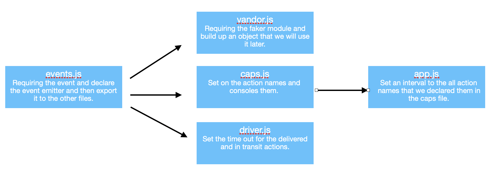
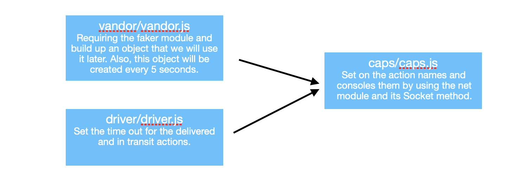
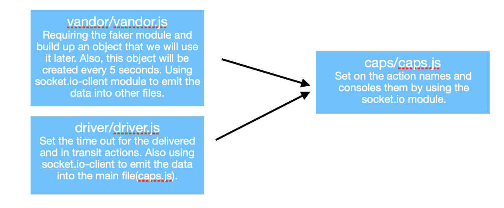

# caps

## Author: Abdulrahman AL-Janabi
## Project: Caps

## Lab 16

### Description of today lab
**In today lab we created an event that will publish and subscribe to the certain action names.**

### Pull Request
- [PR1](https://github.com/Janabi/caps/pull/1)

### Dependencies
- dotenv
- express
- jest
- jest-cli
- faker

### How to start the server
- node app.js

### UML

## Lab 17

### Description of today lab
**In today lab we created an event that will publish and subscribe to the certain action names. Alos, we used the TCP methdology.**

### Pull Request
- [PR1](https://github.com/Janabi/caps/pull/2)

### Dependencies
- dotenv
- jest
- jest-cli
- faker

### How to start the server
- node caps/caps.js
- node driver/driver.js
- node vandor/vandor.js

### UML

## Lab 18

### Description of today lab
**In today lab we created an event that will publish and subscribe to the certain action names. Alos, we used the socket.io and socket.io-client modules.**

### Pull Request
- [PR3](https://github.com/Janabi/caps/pull/3)

### Dependencies
- jest
- jest-cli
- faker
- socket.io-client
- socket.io

### How to start the server
- node caps/caps.js
- node driver/driver.js
- node vandor/vandor.js

### UML
